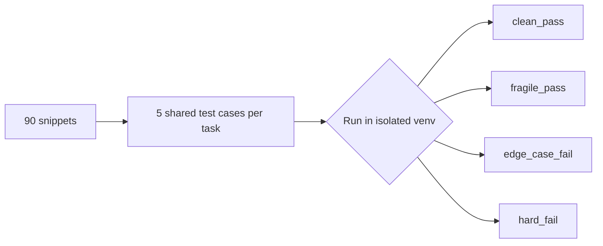
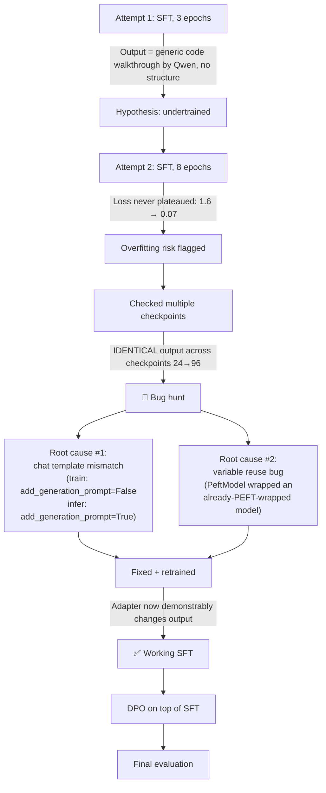
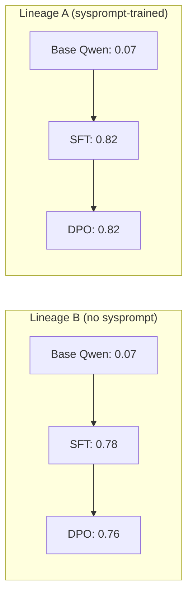

<div align="center">

# AICR
### AI-Generated Code Review Assistant

**Fine-tuning an LLM to review AI-generated code — grounded in real test evidence, not vibes.**

[](https://huggingface.co/Qwen/Qwen2.5-Coder-3B-Instruct)
[](https://arxiv.org/abs/2305.14314)
[]()
[](https://arxiv.org/abs/2305.18290)
[]()


</div>

---

## What is this?

As AI coding assistants (Copilot, Cursor, Claude, GPT) generate more production code, review needs to catch failure patterns specific to **AI-generated output** — confident, well-formatted, but sometimes subtly wrong. AICR fine-tunes a small LLM to review that code with a **validate → critique → fix** structure, using feedback that's grounded in actual test-verified evidence, not subjective judgment.

This repo documents the **entire pipeline** — dataset construction, testing methodology, fine-tuning (SFT + DPO), and every real bug hit along the way. The debugging process is part of the deliverable, not a footnote.


Acronyms Used (for better reading and understanding): 

1. SFT -> Supervised Fine Tuning
2. DPO -> Direct Preference Optimization (Modern Reinforement Learning via Human Feedback technique)
3. LoRA -> Low Rank Adaptation
4. QLoRA -> Quantized Low Rank Adaptation
5. v1, 2, 3 -> version 1, 2, 3
---

## Pipeline overview


---

## 1 · Dataset Construction

### Task design → snippet generation

| Step | Detail |
|---|---|
| **Tasks** | 30 casual, underspecified coding prompts (no edge-case hints) across 4 categories |
| **Categories** | Data parsing · Backend/API logic · Algorithmic · Utility/edge-case functions |
| **Tools** | **Claude**, **GPT**, **Cursor** — same prompt, fresh session each |
| **Output** | 30 tasks × 3 tools = **90 real, independently-generated snippets** |

### Ground truth via testing, not opinion



Every snippet was tested against the **same 5-case suite per task** (normal use, empty/`None`, boundary, malformed input) — written against the *original task requirement*, not any one tool's implementation.

**Notable convergent findings:**
- 🔴 All three tools made the **same mistake** on UTC timezone conversion (`pytz.timezone('UTC')` instead of `pytz.UTC`) — a hard failure on the *normal* case
- 🟡 Claude & GPT both mishandled version-string segment-length comparison (`"1.2"` vs `"1.2.0"`); Cursor got it right
- 🟢 The large majority of edge-case failures across all tools: unhandled `None` input — expected, since no prompt requested it, but a real pattern nonetheless

### Tiering — why raw results weren't used as-is

Naively training on all 90 results would have taught the model **one repetitive lesson** (`None`-handling) instead of general reviewing skill. Results were split into three tiers:

| Tier | What it is | Count | Purpose |
|---|---|---|---|
| **1** | Distinct, non-repetitive bugs (hard fails, multi-failure, or non-`None` edge cases) | 28 | Core reviewing signal |
| **2** | Repetitive `None`-only failures | 20 *(sampled from 54)* | Some None-handling signal, without dominating |
| **3** | Clean / fragile passes | 8 | Teaches the model **not** to hallucinate bugs |

For each entry, a strong LLM generated a **chosen** review (validate → critique, grounded in the real test result) and 1–3 **rejected** variants (blunt, generic-praise, vague, or — for clean passes — a *hallucinated* bug).

**Final dataset: 112 preference pairs** → [`preference_pairs.jsonl`](./Dataset/preference_pairs.jsonl)

---

## 2 · Model Selection

<div align="center">

| Choice | Why |
|---|---|
| **Qwen2.5-Coder-3B-Instruct** | Code-specialized, instruction-tuned, small enough for free-tier QLoRA |
| **QLoRA (4-bit + LoRA)** | ~1% trainable params, fits comfortably on a single T4 |
| **Kaggle (T4×2, 9h sessions)** | More headroom than Colab free tier for iterative debugging |

</div>

> ⚠️ Note: use the plain HF `safetensors` checkpoint, **not** the `-GGUF` version — GGUF is for CPU inference (llama.cpp/Ollama), not `transformers`-based training.

---

## 3 · The Debugging Lore

This project did **not** work on the first, second, or even third try. Each failure taught something real about fine-tuning mechanics — documented here rather than hidden.



### Key bugs, root-caused

<details>
<summary><b>🐛 Bug 1 — Chat template mismatch</b></summary>
<br>

Training used `add_generation_prompt=False`; inference used `add_generation_prompt=True`. The model was trained on a prompt *shape* it never actually saw at generation time — so the LoRA weights learned to respond to a structure that never appeared during real inference. Fixed by matching `add_generation_prompt=True` in both.

</details>

<details>
<summary><b>🐛 Bug 2 — Variable reuse across training/inference cells</b></summary>
<br>

```python
# BROKEN — `model` was already PEFT-wrapped from training
sft_model = PeftModel.from_pretrained(model, ADAPTER_PATH)

# FIXED — always load a clean base model for inference
fresh_base_model = AutoModelForCausalLM.from_pretrained(MODEL_NAME, ...)
sft_model = PeftModel.from_pretrained(fresh_base_model, ADAPTER_PATH)
```

This explains why output looked *identical across checkpoints 24 through 96* — the adapter was never really the thing being run.

</details>

<details>
<summary><b>🐛 Bug 3 — The "it's working" illusion</b></summary>
<br>

A system-message prompt got structure adherence to 70–80%. But a **base-model-only control test** (no adapter at all, same system message) produced **near-identical output** — proving the system prompt, not the fine-tuning, was doing the work. This control test is what caught it.

</details>

### The confirming diagnostic

```
Active adapters: ['default']
Generation WITH adapter active:    "...crashes with a TypeError... consider adding type checking..."
Generation WITH adapter DISABLED:  "1. Function Definition... 2. Return Statement... 3. Syntax..."
Are the two outputs identical? → False
```
✅ First conclusive proof the adapter was actually influencing generation.

---

## 4 · Fine-Tuning Configuration

<table>
<tr><th>Stage</th><th>Config</th></tr>
<tr>
<td><b>SFT</b></td>
<td>

```
LoRA r=16, alpha=32, dropout=0.05
target: q/k/v/o_proj, gate/up/down_proj
lr = 2e-4, epochs = 4
batch=2, accum=4 (effective batch 8)
optim = paged_adamw_8bit
```
</td>
</tr>
<tr>
<td><b>DPO</b></td>
<td>

```
continues from SFT adapter (is_trainable=True)
lr = 5e-6, beta = 0.1, epochs = 2
batch=1, accum=8 (effective batch 8)
reference model = SFT checkpoint (adapter disabled)
```
</td>
</tr>
</table>

Two SFT lineages were trained for comparison:
- **v1** — system instruction **baked into every training example**
- **v2** — **no** system instruction in training

Each was independently carried through DPO (**DPO v1** from SFT-v1, **DPO v2** from SFT-v2).

---

## 5 · Results

### Final held-out comparison (10 unique task/tool examples, system message fixed at inference)

**Lineage A — system prompt baked into SFT:**

| Model | Structure (0–3) | Grounding (0–1) | False-Neg Rate |
|---|:---:|:---:|:---:|
| Base | 1.90 | 0.07 | 0.00 |
| SFT (v1) | 2.80 | 0.82 | 0.00 |
| DPO (v1) | 2.80 | 0.82 | 0.00 |

**Lineage B — no system prompt in SFT:**

| Model | Structure (0–3) | Grounding (0–1) | Clean-pass honesty |
|---|:---:|:---:|:---:|
| Base | 1.90 | 0.07 | — |
| SFT (v2) | 2.00 | 0.78 | ❌ Hallucinated a bug on clean code |
| DPO (v2) | 2.00 | 0.76 | ❌ Hallucinated a bug on clean code |

### What the numbers mean



- **Base → SFT: large, real jump.** Fine-tuning clearly taught the target behavior — prompting the base model alone never got close to this level of grounding.
- **SFT → DPO: no further measurable gain, in either lineage.** DPO's training dynamics explain why: `rewards/chosen` barely moved (+0.04) while `rewards/rejected` dropped sharply (−2.72) — DPO mostly taught the model what to *avoid*, not what to *do better*, at this dataset scale (~90–112 pairs).
- **The lineage choice mattered more than the DPO stage.** Lineage A never hallucinated on the one clean-pass held-out example; Lineage B hallucinated a fake bug on it **both before and after DPO.** DPO did not fix a weakness baked in at the SFT stage.

---

## 6 · What This Project Actually Demonstrates

- ✅ Fine-tuning (SFT) meaningfully surpasses prompting-only on the base model for this task — verified with a proper **base-model control test**, not assumed
- ✅ A system instruction baked into SFT training data is a legitimate technique (**prompt distillation**) — not "cheating," and it produced a measurably safer model
- ✅ DPO's marginal value is **conditional on how much headroom the SFT checkpoint leaves** — it reinforced existing behavior in both lineages rather than independently correcting weaknesses
- ✅ Two silent pipeline bugs (chat template mismatch, PEFT variable reuse) can make a **working fine-tune look completely broken** — caught via systematic diagnostics, not guesswork
- ⚠️ At ~100-pair scale, the model reliably catches the *primary* documented issue but under-performs on snippets with **multiple distinct failures**
- ⚠️ The model has no access to real test execution at inference time — it's pattern-matching plausible critique for **novel** code, which is a structural limitation, not just a training gap

---

## 7 · Repo Structure

```
AICR/
├── .gitattributes
├── .gitignore
├── Dataset/
│   ├── Pref-Pair-Gen.py
│   ├── preference_pairs.jsonl
│   ├── response_generated/ (included 90 tasks responses from different AI)
│   │   ├── problems.md
│   │   ├── results/
│   │   │   └── ground_truth.json
│   │   └── tests/ (included 150 test cases .py programs) 
│   └── verify.py
├── Models/
│   ├── FT-with_sysprompts/
│   │   ├── aicr-sft-adapter-v1.zip
│   │   └── aicr_dpo_adapter_v1.zip
│   └── FT-without_sysprompts/
│       ├── aicr-sft-adapter-v2.zip
│       └── aicr_dpo_adapter_v2.zip
├── Notebook/
│   ├── AICR-DPO-v2.ipynb
│   ├── AICR-DPO.ipynb
│   ├── FT.ipynb
│   ├── aicr-sft-nosysprom.ipynb
│   ├── final_comparison_base_sft-nosysPrmpt_dpo.txt
│   ├── holdout_inference_sysprompt_trained.txt
│   ├── holdout_inference_without_sysprompt_trained.txt
│   └── sys_pmpt_final_comparison_base_sft_dpo.txt
└── README.md
```

---

## 8 · Usage

```python
from transformers import AutoModelForCausalLM, AutoTokenizer, BitsAndBytesConfig
from peft import PeftModel
import torch

bnb_config = BitsAndBytesConfig(load_in_4bit=True, bnb_4bit_quant_type="nf4",
                                 bnb_4bit_compute_dtype=torch.bfloat16)

base_model = AutoModelForCausalLM.from_pretrained(
    "Qwen/Qwen2.5-Coder-3B-Instruct", quantization_config=bnb_config, device_map="auto")

model = PeftModel.from_pretrained(base_model, "models/dpo-adapter-v1")  # recommended lineage
tokenizer = AutoTokenizer.from_pretrained("models/dpo-adapter-v1")

SYSTEM_MESSAGE = (
    "You are a code reviewer. Follow this exact structure: "
    "1) Briefly validate what works (1-2 sentences), "
    "2) Use 'However' to transition to specific failures, "
    "3) Reference specific test cases (Test 3, Test 5, etc.), "
    "4) Provide concrete fixes."
)
# ⚠️ The system message is a hard requirement for this model, not optional —
# it was baked into training and inference without it produces false negatives.
```

---

## 9 · Honest Limitations

- Dataset scale (111 pairs) suits narrow **behavioral** fine-tuning (structure/grounding), not knowledge injection — this is a small-scale experiment by design
- Test suites intentionally probed beyond what casual prompts specified (e.g. `None`-handling) — a deliberate stress test, which is why raw results needed tiering before training
- A small number of Tier 2/3 pairs were generated manually via chat (API credit limits), using the identical prompt template
- The model cannot execute tests at real inference time — grounding on **novel** code is inherently harder than on the training distribution
- DPO evaluation here is based on ~10 held-out examples — informative, not statistically large

---

<div align="center">

**Built by [Ibtesam Hussain](https://github.com/Ibtesam-Hussain)** · Fine-tuned on free-tier Kaggle compute · No app, just the model

</div>
